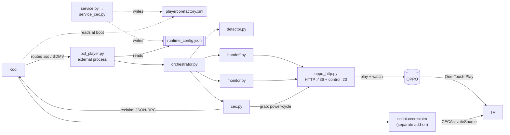

# OppoKodiBridge v4 — architecture & walkthrough

**playercorefactory fork:** Kodi hands a disc to the OPPO *before* playing it (so there's no pre-play
blip), monitors playback for the stop (HTTP `/getglobalinfo` polling — the reference-faithful approach,
all models), and switches the TV using **only legitimate HDMI-CEC** — no IR, no spoofing.

> **This doc is the CEC-handoff deep-dive.** For the whole-system map — including the optional IR
> TV-switch transports, remote passthrough, and TV volume takeover over IR — see
> [`SYSTEM_ARCHITECTURE.md`](SYSTEM_ARCHITECTURE.md).

---

## The 30-second version

Instead of letting Kodi start a disc and then yanking it back (v2's blip), v4 tells Kodi — via
`playercorefactory.xml` — to hand `.iso`/BDMV files to an **external player script** *before* Kodi's
own player touches them. That script runs outside Kodi and:

1. **power-cycles the OPPO** so the OPPO's *own* One-Touch-Play grabs the TV (a device announcing its
   own active source is the only in-spec way to route the TV — no IR, no foreign-initiator injection);
2. plays the file on the OPPO over the network;
3. watches for the stop over HTTP `/getglobalinfo` polling (all models); then
4. asks Kodi to re-assert *its own* active source (the reclaim) and exits.

No blip, and every TV-input assertion is single-shot and tied to an event.

---

## Play flow — click to switch-back

```mermaid
sequenceDiagram
    autonumber
    actor U as You
    participant K as Kodi (+ script.cecreclaim)
    participant P as playercorefactory.xml
    participant X as pcf_player.py (external)
    participant O as OPPO
    participant T as TV

    Note over K,P: At boot, Kodi loads playercorefactory.xml<br/>(the v4 service wrote it; it persists on disk)

    U->>K: Play an .iso / BDMV folder
    K->>P: which player for this file?
    P-->>K: external player "OppoKodiBridge"
    Note over K: Kodi never starts the file → NO pre-play blip
    K->>X: launch  python3 pcf_player.py "nfs://…file"

    X->>X: read runtime_config.json; detector confirms it is a disc

    rect rgb(255,244,232)
    Note over X,T: Grab — single-shot, play-side, model-gated (if grab_tv_on_play)
    alt oppo_model = M9205 (grab-capable)
        X->>O: power-cycle  (#POF → #PON)
        Note over O: the OPPO asserts active source only on a power-ON transition
        O->>T: its OWN One-Touch-Play → TV switches to HDMI-1 (the OPPO)
    else oppo_model = M9207 / UDP-203 (no network grab)
        Note over X,T: grab skipped — switch the TV to the OPPO input manually
    end
    end

    X->>O: HTTP: wake (:7624) → init → login NFS → mount → play (:436)

    rect rgb(232,244,255)
    Note over X,O: Phase 1 — pre-playback (HTTP poll, latency-tolerant)
    loop until playing
        X->>O: HTTP /getglobalinfo
        O-->>X: is_video_playing?
    end
    end

    rect rgb(232,255,236)
    Note over X,O: Phase 2 — HTTP /getglobalinfo poll until idle (all models)
    loop until idle confirmed
        X->>O: HTTP /getglobalinfo
        O-->>X: is_video_playing?
    end
    end

    rect rgb(255,244,232)
    Note over X,T: Reclaim — single-shot, stop-side, in finally (only if cec_reclaim_on_stop)
    X->>K: JSON-RPC Addons.ExecuteAddon script.cecreclaim (127.0.0.1:8080)
    K->>T: Kodi re-asserts its OWN active source (CECActivateSource) → TV back to Kodi
    end

    X-->>K: process exits
    K->>U: back to Kodi
```

### Step by step

**Boot / service startup**
1. Kodi starts and, as part of startup, **loads `playercorefactory.xml`** from userdata. This file was
   written by the v4 service on a *previous* run and **persists on disk** — which is why a fresh
   install needs one restart (the file has to already be there when Kodi boots).
2. The **v4 service** (`service.py` → `resources/lib/service_cec.py`) starts, does two things, and then
   idles:
   - reads the add-on settings (the one place with Kodi APIs) and **dumps them to
     `runtime_config.json`** in the add-on's data dir;
   - **(re)writes `playercorefactory.xml`** pointing Kodi at `pcf_player.py`.
   - (It re-does both on `onSettingsChanged`, and removes the file only if you turn the handoff off.)
   It does **not** intercept playback and does **not** touch CEC — the reclaim is the orchestrator's job.

**You press play on an ISO/BDMV**
3. Kodi consults playercorefactory. The **rules match** `.iso` / `*/BDMV/*` / `*/VIDEO_TS/*` (plus
   `*.bdmv`) and route to the external "OppoKodiBridge" player **instead of Kodi's internal player** —
   so Kodi never starts decoding and there's **no blip**. Those XML rules are *generated from*
   `detector.PCF_RULES`, which is derived from the same `_DISC_SEGMENTS` / suffix constants the
   orchestrator's play-time `detector.is_handoff_target` re-check uses — so the XML routing and the
   runtime classifier match exactly the same files and **cannot drift apart** (pinned by a consistency
   test). HD-DVD (`HVDVD_TS`) is deliberately *not* in that set — the OPPO can't play it, so it stays
   in Kodi rather than triggering a failed handoff.
4. Kodi launches `/usr/bin/python3 pcf_player.py "<the nfs:// file path>"` as a **separate process**
   and waits for it to exit.

**The external player hands off (pure network + a localhost reclaim, no in-process CEC)**
5. `pcf_player.py` reads `runtime_config.json` (locating it from its own path) → builds a `Config` →
   calls `orchestrator.run(config, file)`.
6. `orchestrator.run` re-checks `detector.is_handoff_target` and that an OPPO is configured, then:
   - **Grabs the TV for the OPPO** (play-side, single-shot, gated by `grab_tv_on_play` **and**
     `cec.grab_supported`): `cec.grab_oppo` calls `oppo_http.power_cycle()` (`#POF` → `#PON`). The OPPO
     asserts active source only on a power-**ON** transition, so an already-on OPPO is power-cycled to
     re-grab. This is non-fatal — a failure is logged and the handoff continues. **Model-gated:** on the
     M9207 Plus / UDP-203 the grab is skipped entirely (its `#PON` is a no-op and the `#POF` sleep
     wedges the unit), regardless of `grab_tv_on_play`; switch that unit's TV input manually.
   - **Plays on the OPPO over HTTP** (`handoff.play`): wake (`:7624`) → init dance
     (firmware/setup/signin/globalinfo) → resolve the OPPO's own NFS server (`/getdevicelist`) →
     `loginNfsServer` → `mountNfsSharedFolder` → `/playnormalfile` (files/ISO) or
     `/checkfolderhasBDMV` (discs). The mount/play layout is the same for every model: mount the file's
     folder and play the bare leaf name (the OPPO won't play sub-paths of a mount). `oppo_model` does
     not affect the mount/play layout — since v4.1.3 it gates **only** the play-side TV grab (the M9207
     skips the grab — see `cec.grab_supported`); stop detection is HTTP-only for every model.

**Monitoring — two phases (`monitor.watch_playback`, asserts nothing)**
7. **Phase 1 — pre-playback (HTTP):** poll `/getglobalinfo` until the OPPO *actually* starts playing
   (NFS mount + buffer can take ~10s). Latency-tolerant, so HTTP owns this window; it gives up after a
   grace count if playback never starts.
8. **Phase 2 — playing (HTTP stop detection, all models):** poll `/getglobalinfo` until the OPPO is
   idle for N consecutive reads. The watch uses a tri-state probe (a transient blip is never mistaken
   for a stop, so no premature mid-playback reclaim) plus read-failure and watch-time ceilings, so the
   watch always returns and the reclaim always runs. This is the **reference-faithful** approach — the
   proven emby-chinoppo-bridge monitors purely over HTTP; v4's earlier verbose `#SVM 3` push watch on
   `:23` (M9205-only) was **removed in v4.1.3** as unverified and implicated in the IR remote locking up.

**Stop / switch-back**
9. The reclaim runs in the orchestrator's `finally`, so it fires whether playback succeeded or failed
   (stop-side, single-shot, gated by `cec_reclaim_on_stop`): `cec.reclaim_kodi` makes a **localhost
   JSON-RPC** call (`Addons.ExecuteAddon` → `script.cecreclaim`) to Kodi's web server
   (`127.0.0.1:8080`). `script.cecreclaim` calls `CECActivateSource`, so **Kodi re-asserts its own
   active source** and the TV returns to Kodi's input. The call is non-fatal — a failure is logged and
   never raised.
10. `pcf_player` exits; Kodi sees the external player exit and resumes the foreground.

---

## Component map



| File | Role |
|------|------|
| `service.py` → `resources/lib/service_cec.py` | The service. Writes `playercorefactory.xml` + `runtime_config.json` on start; idles; refreshes on `onSettingsChanged`; removes the XML only when the handoff is turned off. **Does not** intercept playback or touch CEC. |
| `resources/lib/pcf.py` | Builds + installs/uninstalls `playercorefactory.xml` — the routing rules (from `detector.PCF_RULES`) plus the external-player command. Backs up / restores a user's own file via a marker guard. |
| `pcf_player.py` | **The external player** Kodi launches. Runs outside Kodi (no `xbmc`), loads `runtime_config.json`, calls `orchestrator.run`, and never crashes the player process. |
| `resources/lib/orchestrator.py` | The flow: `detect → grab (cec) → play (handoff) → watch (monitor) → reclaim (cec, in finally)`. |
| `resources/lib/detector.py` | Which files qualify for handoff — disc images (`.iso`) and disc folders (BDMV / VIDEO_TS). Home of **both** the playercorefactory routing rules (`PCF_RULES`) and the runtime check (`is_handoff_target`); `PCF_RULES` is **derived** from the same `_DISC_SEGMENTS` / suffix constants the runtime uses, so the two match the same files and cannot drift. |
| `resources/lib/handoff.py` | Headless OPPO playback over the HTTP app API (path map → wake → init → NFS login/mount → play). **No** TV/CEC switching and no monitoring. |
| `resources/lib/cec.py` | The **only** place this add-on asserts CEC: `grab_oppo` (OPPO power-cycle → its own One-Touch-Play) + `reclaim_kodi` (localhost JSON-RPC → `script.cecreclaim` → `CECActivateSource`). Both single-shot, both non-fatal. |
| `resources/lib/monitor.py` | Two-phase playback watch — HTTP `/getglobalinfo` poll until playing, then poll until idle (**HTTP-only for every model**). Reports state; **asserts nothing**. |
| `resources/lib/oppo_http.py` | OPPO protocol client (HTTP `:436` app API + control `:23` for `#POF`/`#PON`), incl. `power_cycle` and the `/getglobalinfo` playback probes. |
| `resources/lib/config.py` | `Config`; `from_addon()` (service, in Kodi) and `from_dict()` (external player, via the JSON). |
| `script.cecreclaim` | A **separate companion Kodi add-on** (the reclaim target) that calls `CECActivateSource`. **Not bundled in this repo** — install it alongside this add-on. |

---

## Non-obvious design decisions

- **`runtime_config.json` is the bridge.** The external player can't call `xbmcaddon`, so the service
  (which can) dumps the resolved settings to JSON for it to read.
- **The playercorefactory.xml must persist.** Kodi reads it only at **startup**, before any add-on
  runs — so the service can't "set it up just in time." It writes it and leaves it; fresh installs
  need one Kodi restart.
- **Pure, spec-legitimate CEC — no injection.** HDMI-CEC has only two routing primitives:
  `<Active Source>` (a device announces **its own** source) and `<Set Stream Path>` (**TV-only**). So no
  third party may drive the TV to the OPPO's input — the only in-spec lever is the OPPO's *own*
  One-Touch-Play, forced by the power-cycle. The reclaim is symmetric: **Kodi** re-asserts **its own**
  active source. There is deliberately **no IR blaster** and **no foreign-initiator `<Active Source>` /
  `<Set Stream Path>`** (which corrupts the shared bus — the root cause that motivated this fork).
- **Assert once per event, never re-assert.** The grab fires once on play, the reclaim once on stop
  (in the `finally`). There is **no standing monitor** re-asserting active source — that would override
  a manual input change and make the TV un-leaveable (CEC is open-loop; it can't tell "the TV missed my
  frame" from "the user switched away"). So if you switch the TV input by hand, your choice **stays**.
- **The power-cycle is the deliberate cost.** Grabbing via the OPPO's own One-Touch-Play means a
  ~20–24 s OPPO power-cycle on every handoff — the price paid for zero extra hardware and a clean bus.
- **Stop detection is HTTP-only, matching the reference.** The OPPO's verbose `#SVM 3` channel on `:23`
  is never opened: the proven emby-chinoppo-bridge monitors purely over `/getglobalinfo`, the verbose
  channel's behaviour on the clones is unverified, and holding that socket is implicated in the IR
  remote locking up. `oppo_model` therefore affects only the play-side grab.

---

## v2 → v3 → v4

- **v2:** service monitor — Kodi starts the file, the add-on stops it and hands off (brief **blip**);
  HTTP poll for stop; CEC power-cycle + `CECActivateSource` reclaim.
- **v3:** playercorefactory — Kodi hands the file off before playing it (**no blip**); verbose `#SVM 3`
  for instant stop; switched the TV with a **Broadlink IR blaster** (CEC-free).
- **v4:** playercorefactory (**no blip**) + HTTP `/getglobalinfo` stop watch (all models — the
  reference-faithful approach; the M9205-only verbose `#SVM 3` watch was removed in v4.1.3), but
  switches the TV with **pure, spec-legitimate HDMI-CEC** — the OPPO's own One-Touch-Play grab + Kodi's
  own single-shot reclaim via `script.cecreclaim`. **No IR, no injection.** (The historical IR design is
  captured, as superseded reference, in [`IR_INTEGRATION.md`](IR_INTEGRATION.md).)

> These diagrams render inline on GitHub.
