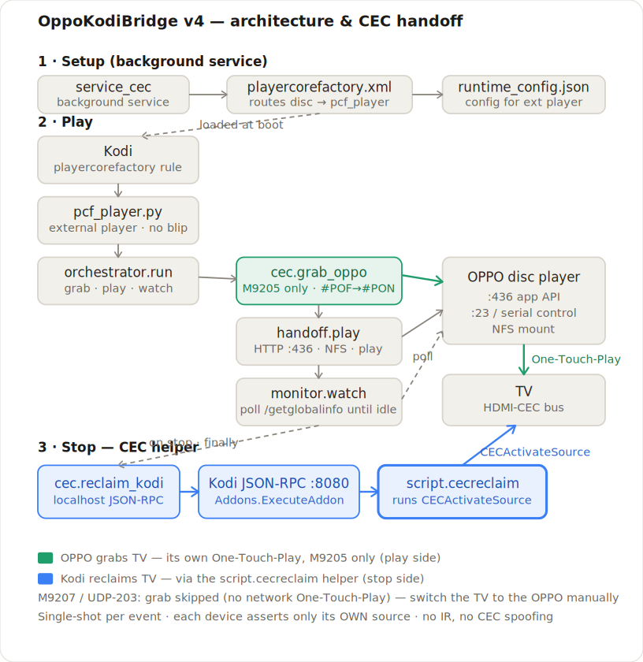
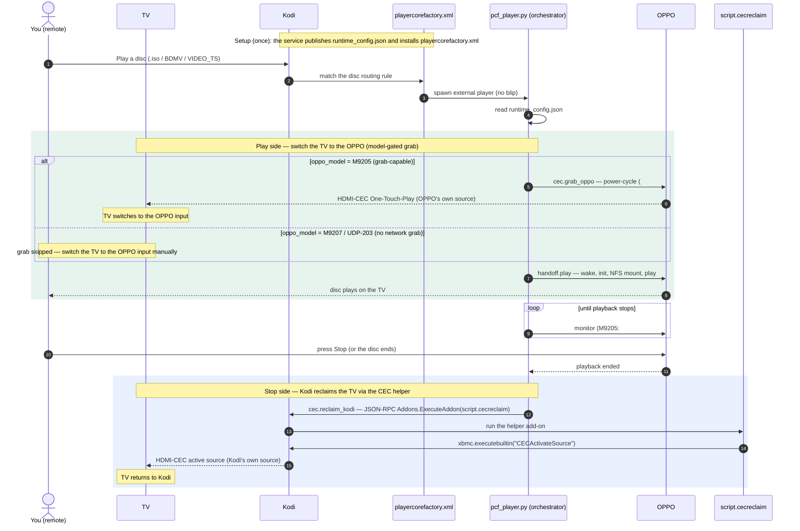

# OppoKodiBridge v4 — design diagrams

Two views of the same pipeline:

1. **Architecture & CEC handoff** — the modules, the devices, and the two single-shot CEC assertions
   (green = the OPPO grabs the TV on play; blue = Kodi reclaims the TV on stop, via the helper).
2. **User journey** — what happens, in order, from pressing Play to the TV returning to Kodi on Stop.

---

## 1 · Architecture & CEC handoff

> If the image above doesn't render in your Markdown viewer, open the SVG directly:
> [`docs/diagrams/oppokodibridge-v4-architecture.svg`](diagrams/oppokodibridge-v4-architecture.svg)

**How the CEC helper is used.** The whole pipeline runs in `pcf_player.py`, which Kodi spawns as an
**external player — a separate OS process outside Kodi** (so disc content never touches Kodi's own
player → no pre-play blip). That process has **no `xbmc` API**, so it cannot call
`xbmc.executebuiltin("CECActivateSource")` itself. On stop, `orchestrator.run`'s `finally` calls
`cec.reclaim_kodi`, which reaches back into Kodi over **localhost JSON-RPC** (`Addons.ExecuteAddon`,
`addonid: script.cecreclaim`); the tiny in-Kodi **`script.cecreclaim`** helper runs the
`CECActivateSource` builtin so Kodi re-announces **its own** active source and the TV returns to Kodi.
The grab side does **not** use the helper — the OPPO grabs the TV via its own One-Touch-Play, forced by
a `#POF`→`#PON` power-cycle. **The grab is model-gated** (`cec.grab_supported`): on the M9207 Plus /
UDP-203 the network power-cycle is a no-op that also wedges the unit, so the grab is skipped entirely
and the TV is switched to the OPPO input manually. Each device asserts only its **own** HDMI source
(no IR, no spoofed initiator), and both assertions are **single-shot** (tied to play/stop events — no
standing re-asserter, so a manual input change sticks).

---

## 2 · User journey

### Step notes

- **No blip:** Kodi's `playercorefactory.xml` routes disc content to the external player *before*
  Kodi's own player ever opens the file — there is no momentary Kodi playback before the handoff.
- **The ~20–24 s cost:** the OPPO only asserts active source on a power-**ON** transition, so the grab
  is a deliberate `#POF`→`#PON` power-cycle.
- **`oppo_model` gates BOTH sides (since v4.1.2):** on the **M9205** the OPPO grabs the TV (power-cycle)
  and stop is detected with a verbose `#SVM 3` push watch on `:23` (HTTP cross-check + absolute ceiling,
  since v4.1.1). On the **M9207 Plus / UDP-203** the grab is skipped entirely (its `#PON` is a no-op
  that wedges the unit) — switch the TV manually — and stop is detected by HTTP `/getglobalinfo`
  polling only (it never opens `:23`). Selecting `M9207` is now the single knob; you no longer also
  have to turn off `grab_tv_on_play`.
- **Reclaim always runs:** `cec.reclaim_kodi` is in the orchestrator's `finally`, so the TV is
  reclaimed whether playback succeeded or failed — once, never re-asserted.
