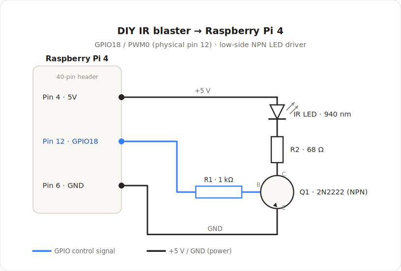
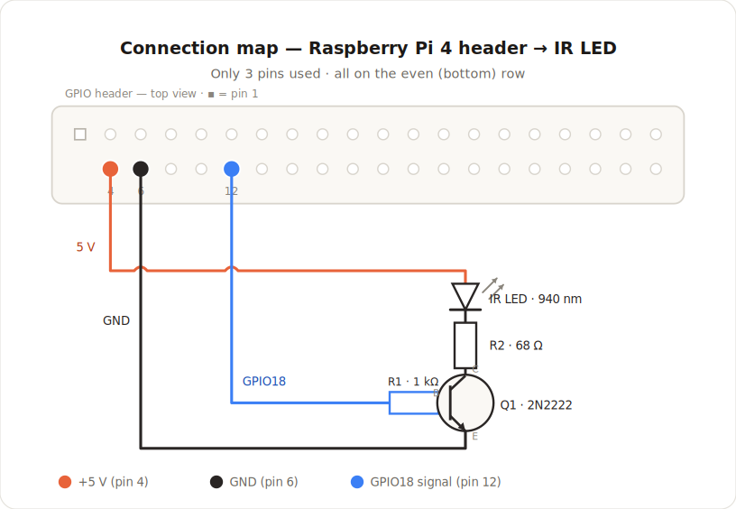
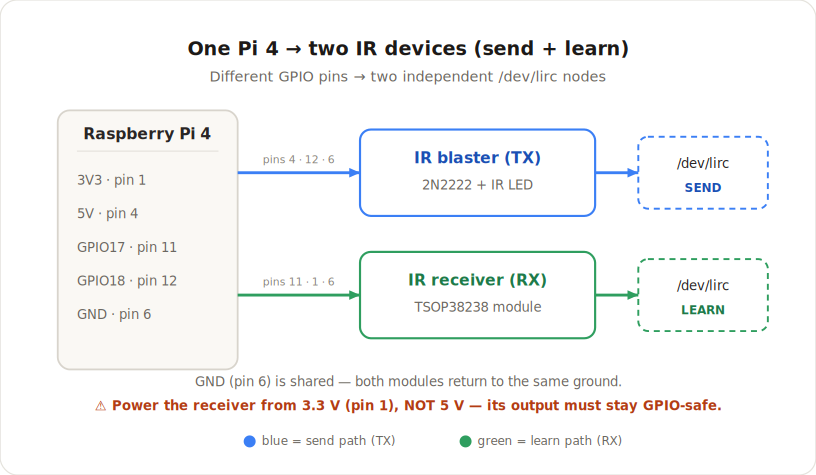
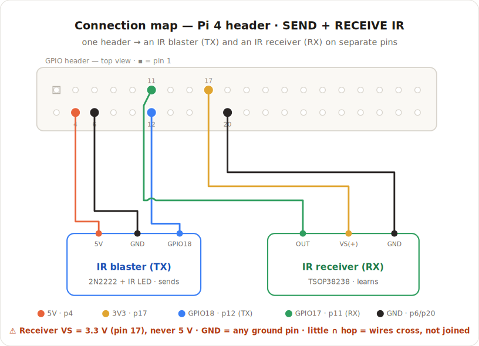

# IR TV-input switching via LIRC on a Raspberry Pi 4 — DIY blaster + learner

> **Status:** Reference / bench-build guide · 2026-07-05 · the *software* transport
> (`tv_switch_method: lirc`) is **not built** — it is tracked by
> [#23](https://github.com/skull-01/OppoKodiBridge-v4/issues/23) and needs Protocol 1 to build.
> This document is the **hardware + host-side** reference: parts, wiring, kernel overlays, and how to
> learn/send codes with `ir-ctl`.

This is the **"roll your own"** IR path: instead of a proprietary serial module
([`IR_TV_SWITCHING_BUILD_PLAN.md`](IR_TV_SWITCHING_BUILD_PLAN.md), ZJIoT) or a WiFi blaster
([`IR_INTEGRATION.md`](IR_INTEGRATION.md), Broadlink RM4 — **superseded**), you wire cheap parts to a
Raspberry Pi 4 GPIO and let the **Linux kernel + LIRC** emit standard **NEC**. The kernel owns the
38 kHz carrier and pulse timing, so **there is no proprietary waveform to reverse-engineer** — the main
risk in the ZJIoT plan disappears.

It fires the TV's **own HDMI-input code** on play (&#8594; OPPO) and stop (&#8594; Kodi) — the clean
alternative to the HDMI-CEC power-cycle grab that wedges the M9207
([#5](https://github.com/skull-01/OppoKodiBridge-v4/issues/5),
[#20](https://github.com/skull-01/OppoKodiBridge-v4/issues/20)). All OPPO control stays on the network
`:436` API.

> **Host note.** The shipped v4 design assumes the Kodi host is the **Ugoos AM6B+ (Amlogic)**. This guide
> targets a **Raspberry Pi 4**, which has first-class kernel IR-**transmit** overlays (the Amlogic box
> does not). If the Pi *is* your Kodi/LibreELEC box, the add-on fires IR locally; if it is a *separate*
> blaster box, it needs a way to receive the "switch now" command (SSH/HTTP) — see
> [#23](https://github.com/skull-01/OppoKodiBridge-v4/issues/23).

---

## 1 · Bill of materials (~$3)

| Part | Value / spec | Notes |
|------|--------------|-------|
| **IR LED** | 940 nm (TSAL6200 / TSAL6400 / generic 5 mm) | 940 nm matches almost every TV receiver |
| **Q1 — NPN transistor** | 2N2222 / PN2222 / BC337 | Any small-signal NPN. MOSFET (2N7000) also works |
| **R1 — base resistor** | 1 k&#937; | GPIO18 &#8594; base; limits base current (~2.6 mA) |
| **R2 — LED resistor** | 68 &#937; (47–100 &#937; range) | Lower = more range; stay within the LED's current rating |
| **IR receiver** *(optional, for learning)* | TSOP38238 (or VS1838B) | 3-pin demodulating module — OUT / GND / VS |
| Breadboard / protoboard + jumper wires | — | Or solder onto perfboard |

---

## 2 · The blaster circuit (transmit)



> If the image doesn't render, open it directly:
> [`docs/diagrams/oppokodibridge-v4-ir-blaster-schematic.svg`](diagrams/oppokodibridge-v4-ir-blaster-schematic.svg)

It's a **low-side switch**. The GPIO pin is weak (3.3 V, ~16 mA) and never touches the LED — it only
drives the **transistor base** through R1. The LED runs off the stronger **5 V** rail, and the
transistor switches its ground path thousands of times a second to make the 38 kHz carrier:
`+5 V → LED → R2 → collector → emitter → GND`, gated by `GPIO18 → R1 → base`.

> **MOSFET variant:** swap Q1 for a 2N7000, drive the gate straight from GPIO18, drop R1 to ~100 &#937;
> and add a 10 k&#937; gate-to-ground pulldown. The BJT above is more beginner-forgiving.

### Which physical pins



> Fallback: [`docs/diagrams/oppokodibridge-v4-ir-blaster-pinmap.svg`](diagrams/oppokodibridge-v4-ir-blaster-pinmap.svg)

| Wire | RPi4 pin | Connects to |
|------|----------|-------------|
| **+5 V** | **Pin 4** (5V) | IR LED **anode** (the longer leg) |
| *(in-circuit)* | — | LED **cathode** → **R2 (68 &#937;)** → Q1 **collector** |
| **Signal** | **Pin 12** (GPIO18) | **R1 (1 k&#937;)** → Q1 **base** |
| **Ground** | **Pin 6** (GND) | Q1 **emitter** |

GPIO18 is chosen because it is also **PWM0** — that lets the kernel generate the 38 kHz carrier in
hardware (the `pwm-ir-tx` overlay), which is cleaner than software bit-banging.

---

## 3 · Adding the receiver (learn codes)

You can run a **transmitter and a receiver at the same time** — the kernel exposes them as two
independent devices on different GPIO pins.



> Fallback: [`docs/diagrams/oppokodibridge-v4-ir-tx-rx-blocks.svg`](diagrams/oppokodibridge-v4-ir-tx-rx-blocks.svg)

Both modules on one header:



> Fallback: [`docs/diagrams/oppokodibridge-v4-ir-send-receive-map.svg`](diagrams/oppokodibridge-v4-ir-send-receive-map.svg)

> This combined map powers the receiver from **pin 17** (3.3 V) and grounds it on **pin 20** purely for
> tidy wire routing — **pin 1** (3.3 V) and **pin 6** (GND) work identically; use whichever is convenient.

### Receiver wiring — TSOP38238 (3 wires)

Check the module's silkscreen for the three legs (**OUT / GND / VS**):

| Receiver leg | RPi4 pin | Note |
|--------------|----------|------|
| **VS (+)** | **3.3 V — pin 1** (or pin 17) | ⚠️ **Not 5 V.** A 5 V-powered TSOP outputs 5 V logic → can damage the 3.3 V GPIO |
| **GND** | any GND (pin 6 / 9 / 14 / 20 …) | Shared ground with the blaster |
| **OUT** | **GPIO17 — pin 11** | The receiver's data line |

Datasheet nicety (optional): a **100 &#937;** resistor in series on VS + a **4.7 µF** cap from VS→GND to
filter the supply. Keep the receiver a few cm from the blaster LED so your own transmissions don't blind
it — irrelevant when *learning the TV remote*, which you aim at the receiver.

---

## 4 · Enable IR in software (config.txt)

Add the overlay line(s) to the Pi's boot config, then reboot.

- **Raspberry Pi OS (Bookworm):** `/boot/firmware/config.txt`
- **LibreELEC / CoreELEC on Pi:** `/flash/config.txt` (remount first: `mount -o remount,rw /flash`)

```ini
# Transmitter — hardware PWM carrier on GPIO18 (physical pin 12):
dtoverlay=pwm-ir-tx,gpio_pin=18
# Fallback TX — software bit-bang, any GPIO, higher CPU:
# dtoverlay=gpio-ir-tx,gpio_pin=18

# Receiver (only if you added the TSOP) — GPIO17 (physical pin 11):
dtoverlay=gpio-ir,gpio_pin=17
```

Reboot, then confirm the device node(s):

```bash
ls -l /dev/lirc*            # /dev/lirc0 (TX only) — or lirc0 + lirc1 (TX + RX)
ir-keytable                 # lists rc-core receivers — the gpio-ir RX shows here (+ a /dev/input/event*)
sudo apt install v4l-utils  # provides ir-ctl + ir-keytable (already bundled on LibreELEC)
```

### Which node is TX vs RX

Probe order is **not** guaranteed — do **not** assume `lirc0` is the transmitter. Identify by capability:

```bash
ir-ctl --features -d /dev/lirc0   # look for "Device can send" / "Device can receive"
ir-ctl --features -d /dev/lirc1
```

Best practice: pin stable names with a udev rule (e.g. `/dev/lirc-tx`, `/dev/lirc-rx`) so scripts don't
break across reboots.

---

## 5 · Learn a code, then send it

```bash
# Find the receiver first (gpio-ir is an rc-core device):
ir-keytable                       # lists rc devices + their /dev/lirc and /dev/input/event paths

# LEARN (decoded) — reads the rc-core INPUT side; enable NEC first or it prints nothing:
sudo ir-keytable -p nec -t        # press the remote's HDMI/Source button → prints the scancode
# LEARN (raw) — reads the /dev/lirc RAW side instead:
ir-ctl -d /dev/lirc-rx -r         # pulse/space capture

# SEND — replay what you captured, on the TX node:
ir-ctl -d /dev/lirc-tx -S nec:0x57e310ef      # <-- replace with YOUR captured code
```

> **Two interfaces — don't mix them up.** `gpio-ir` is an *rc-core* receiver: the kernel decodes to
> `/dev/input/event*`, which is what `ir-keytable -t` reads (enable the protocol with `-p nec` first, or
> it prints nothing). `ir-ctl -r` instead reads the *raw* `/dev/lirc*` node. Both learn the code — they're
> just different sides of the same receiver.

**Sanity check without a TV:** point a **phone camera** at the IR LED while sending — most phone cameras
render the invisible 940 nm flash as a faint purple/white flicker.

> ### ⚠️ Do not trust circulated codes — capture yours
> [`IR_INTEGRATION.md`](IR_INTEGRATION.md) flags the circulated NEC `0x57E3` set as **wrong protocol**
> for the TCL RCA-`0x0F` panel. Whatever scancode the *real remote's* HDMI/Source button emits (learned
> on the RX) is the value to replay — no guessing.

---

## 6 · Software integration (tracked by #23 — not built)

The add-on side is small and stdlib-only, so it fits `pcf_player`'s external plain-python3 process (no
Kodi APIs):

```python
# on play → OPPO input, on stop → Kodi input
subprocess.run(["ir-ctl", "-d", cfg.ir_tx_device, "-S", f"nec:{cfg.ir_code_oppo}"], timeout=3)
```

A new `tv_switch_method: lirc` (alongside `none | cec | ir`) selects it; default OFF so the feature lands
and is testable without hardware. See [#23](https://github.com/skull-01/OppoKodiBridge-v4/issues/23) for
the full config/orchestrator shape. **No runtime code exists yet** — building it needs Protocol 1.

---

## 7 · Gotchas & safety

- **Never** drive the IR LED straight off a GPIO — always through the transistor; run the **LED off 5 V**
  (pin 4), not 3.3 V, for range.
- **Power the receiver from 3.3 V**, never 5 V — its idle-high output must stay GPIO-safe.
- Respect the LED's peak current — 68 &#937; on 5 V is ~50 mA (safe continuous for most IR LEDs); go to
  47 &#937; only if the datasheet allows.
- **Common ground** — every return must reach a Pi GND pin, not a separate supply.
- **Line of sight** — the LED must face the TV's IR window; range is a few metres with one LED.
- GPIO18 doubles as I²S bit-clock — if an audio HAT uses it, move TX to another pin. Only
  GPIO12/13/18/19 are hardware-PWM pins, so `pwm-ir-tx` must use one of those; any other pin needs the
  bit-banged `gpio-ir-tx,gpio_pin=<other>`.
- **Open-loop:** IR has no readback. Use a **discrete** HDMI-input code (idempotent); a bare Source/Input
  **toggle** is non-idempotent and will drift.

---

## 8 · Lower-effort alternative

If you'd rather not build a second GPIO circuit, a **USB IR receiver** (Flirc USB, or any MCE USB
receiver) enumerates as its own rc/lirc device with **zero wiring** — plug it in for the *learn* half and
keep the GPIO blaster for TX. (A Flirc is receive-only, which is exactly right here.)

---

## See also

- [`IR_TV_SWITCHING_BUILD_PLAN.md`](IR_TV_SWITCHING_BUILD_PLAN.md) — the **ZJIoT serial** transport plan
  (this LIRC path is an alternative to it; pick one to build).
- [`IR_INTEGRATION.md`](IR_INTEGRATION.md) — the **superseded** Broadlink RM4 design (historical).
- [`ARCHITECTURE.md`](ARCHITECTURE.md) · [`DIAGRAMS.md`](DIAGRAMS.md) — the shipped CEC-based handoff.
- [#23](https://github.com/skull-01/OppoKodiBridge-v4/issues/23) — the tracking issue for the code build.
