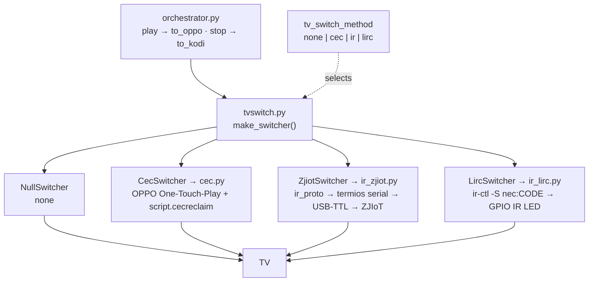
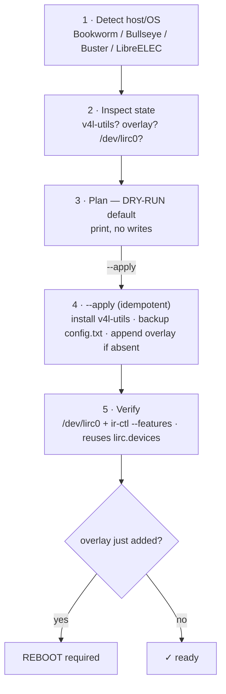

# Design — pluggable TV-switch transports (CEC + two separate IR modules)

> **Status:** Proposed · 2026-07-05 · **not built** (tracked by
> [#26](https://github.com/skull-01/OppoKodiBridge-v4/issues/26) runtime,
> [#27](https://github.com/skull-01/OppoKodiBridge-v4/issues/27) provisioner) · needs Protocol 1 to build.
> **Related:** [#23](https://github.com/skull-01/OppoKodiBridge-v4/issues/23) (LIRC path) ·
> [#24](https://github.com/skull-01/OppoKodiBridge-v4/issues/24)/[#25](https://github.com/skull-01/OppoKodiBridge-v4/issues/25)
> (dev consoles) · [`IR_TV_SWITCHING_BUILD_PLAN.md`](IR_TV_SWITCHING_BUILD_PLAN.md) (ZJIoT) ·
> [`IR_LIRC_RPI4.md`](IR_LIRC_RPI4.md) (LIRC/RPi4) · [`ARCHITECTURE.md`](ARCHITECTURE.md) (CEC today).
>
> **Locked decisions:** provisioner is **dry-run by default**; the receiver overlay is **`--with-receiver`
> opt-in**; `lirc_console.py` gets a **"Prepare this Pi" button** that shells the provisioner.

## Problem

Today TV-input switching is **CEC-only**, wired straight into the orchestrator via `cec.py`
(see [ARCHITECTURE.md](ARCHITECTURE.md)):

- **grab** (play-side): OPPO One-Touch-Play, forced by a `#POF`→`#PON` power-cycle (~20–24 s each handoff;
  **skipped/harmful on the M9207**), and
- **reclaim** (stop-side): a localhost JSON-RPC call to the separate **`script.cecreclaim`** add-on, which
  runs `CECActivateSource`.

IR is the clean alternative — no power-cycle, works on the M9207, and (unlike CEC) needs **no companion
Kodi add-on**, because `ir-ctl` is just an external command the `pcf_player` process can run directly. But
there are **two** IR transports that must not be conflated:

- **ZJIoT serial** — a serial IR module over USB-TTL (fits the Ugoos / CoreELEC / Amlogic host, which has
  no GPIO IR-TX overlay).
- **LIRC / GPIO** — a GPIO IR LED driven by the kernel via `ir-ctl` (fits the **Raspberry Pi 4**, which
  has first-class `pwm-ir-tx` / `gpio-ir` overlays).

## The strategy layer

Route TV-switching through one new selector, `resources/lib/tvswitch.py`, and make CEC just one strategy
among several. The orchestrator stops calling `cec` inline and instead builds a switcher and calls
`to_oppo()` / `to_kodi()`.



`make_switcher(config)` returns an object satisfying one interface — `to_oppo()` and `to_kodi()`, each an
**honest bool, non-fatal, single-shot** (the exact contract `cec` has today, so failure is logged and the
OPPO still plays).

| `tv_switch_method` | Module | How it switches the TV | Host |
|---|---|---|---|
| `cec` *(default)* | `cec.py` *(existing)* | OPPO One-Touch-Play + `script.cecreclaim` | Ugoos / CoreELEC |
| `ir` | **`ir_zjiot.py`** *(new)* | `ir_proto` frame → **termios serial** → USB-TTL → ZJIoT module | Ugoos / CoreELEC |
| `lirc` | **`ir_lirc.py`** *(new)* | `subprocess` → `ir-ctl -S nec:<code>` → GPIO IR LED | **Raspberry Pi 4** |
| `none` | `NullSwitcher` | no-op (switch manually) | any |

**The two IR transports are genuinely separate** — `ir_zjiot.py` speaks binary serial frames (via the
shared `ir_proto` codec), `ir_lirc.py` shells out to `ir-ctl` and lets the *kernel* generate NEC. They
share **no transport code**; only the selector and the config connect them. LIRC is unambiguously the
RPi4 path.

## New modules

- **`resources/lib/tvswitch.py`** — the selector/factory + the four strategy classes.
- **`resources/lib/ir_proto.py`** — the ZJIoT frame codec + NEC synthesis, **promoted from
  `tools/ir/proto.py`** so runtime and the dev consoles share one codec. (LIRC doesn't use it — the
  kernel does NEC.)
- **`resources/lib/ir_zjiot.py`** — `ZjiotSwitcher`: opens the serial port with **termios** (mirroring
  `oppo_http.serial_command`, POSIX-only — fine on CoreELEC), sends the stored HDMI-input codes.
- **`resources/lib/ir_lirc.py`** — `LircSwitcher`: `subprocess` → `ir-ctl -d <dev> -S nec:<code>`.

All **stdlib** (termios / subprocess) — no pip, so the add-on stays a runtime-only zip. The dev consoles
(`tools/`) used pyserial for Windows convenience; the runtime does not.

## The one orchestrator change

```python
# resources/lib/orchestrator.py (sketch)
switcher = tvswitch.make_switcher(config)     # was: implicit cec
...
switcher.to_oppo()                            # was: cec.grab_oppo(...)
try:
    handoff.play(...)
    monitor.watch_playback(...)
finally:
    switcher.to_kodi()                        # was: cec.reclaim_kodi(...)
```

## Config additions (`config.py` + `settings.xml` + `strings.po`)

- `tv_switch_method` — `none | cec | ir | lirc` (**default `cec`**).
- `ir_serial_port` — e.g. `/dev/ttyUSB0` (ZJIoT).
- `ir_lirc_device` — e.g. `/dev/lirc0` (LIRC; or a stable udev name).
- `ir_code_oppo` / `ir_code_kodi` — the TCL HDMI-input codes (captured via the dev consoles).

## Zero regression

Default `tv_switch_method = cec` → the orchestrator behaves **exactly** as today; it just calls
`CecSwitcher` instead of inline `cec`. Nothing changes until a host explicitly opts into `ir` / `lirc`.

## RPi4 provisioning — `tools/setup_rpi4_lirc.py` (#27)

The `lirc` transport needs the Pi prepared once (package + overlay). Rather than a copy-paste checklist, a
small **CLI provisioner** does it — headless-friendly (run over SSH before there's a desktop), and
**standalone in `tools/`**: it edits `/boot` config and runs `apt`, which needs root and a reboot, so it
must be an explicit one-time step — **never** something the add-on does at Kodi startup.



```
python3 tools/setup_rpi4_lirc.py                 # dry-run (default) — prints the plan, no writes
sudo python3 tools/setup_rpi4_lirc.py --apply    # install + patch config.txt + verify
sudo python3 tools/setup_rpi4_lirc.py --apply --with-receiver   # also add gpio-ir (RX, for learning)
python3 tools/setup_rpi4_lirc.py --verify-only   # report state only
```

**Locked behaviour:** dry-run by default (needs `--apply`) · `--with-receiver` opt-in (TX overlay always,
RX only with the flag) · backs up `config.txt` first · idempotent (grep before append) · needs sudo ·
**never auto-reboots** (reports it; opt-in `--reboot`) · a `--verify-only` mode. A **"Prepare this Pi"
button** in `lirc_console.py` shells the same script.

**Cross-OS `config.txt` path** (the main value over a manual checklist):

| OS | config.txt | package |
|---|---|---|
| Bookworm | `/boot/firmware/config.txt` | `apt install v4l-utils` |
| Bullseye / Buster | `/boot/config.txt` | `apt install v4l-utils` |
| LibreELEC | `/flash/config.txt` (remount rw) | bundled — skip apt |

Overlays added: `dtoverlay=pwm-ir-tx,gpio_pin=18` (TX, always) · `dtoverlay=gpio-ir,gpio_pin=17`
(RX, only with `--with-receiver`).

## How the dev tools feed the runtime

The consoles (#24 ZJIoT, #25 LIRC) **capture the real TCL HDMI codes** into the shared JSON code library;
the operator pastes those into `ir_code_oppo` / `ir_code_kodi`. So the flow is:

```
setup_rpi4_lirc.py --apply → reboot → lirc_console.py (capture codes)
  → settings: tv_switch_method=lirc + ir_code_oppo/kodi
```

The consoles are **dev/bench tools only** — never a runtime dependency; the runtime `ir_lirc.py` just
calls `ir-ctl`.

## Deployment note (a Pi that isn't the Kodi host)

The above assumes the **RPi4 is the Kodi host** (Kodi/LibreELEC on the Pi) — then `ir_lirc.py` and
`ir-ctl` are co-located and it's a local call, no extra software. If instead the Pi is a **separate
blaster box** (Kodi runs elsewhere), the add-on would need a tiny listener on the Pi (SSH / small HTTP
endpoint) to trigger `ir-ctl` remotely — out of scope here; flag it if that's the target.

## Open question (decide before build)

`tv_switch_method` **manual** vs **auto-detected** from the host (`/dev/lirc*` present → lirc; a
configured serial port → ir; else cec). Leaning **manual with a sensible default** to avoid surprise
switching.

## Not built

Everything here is a proposal. Building it needs Protocol 1: the runtime (#26) and the provisioner (#27),
each with an independent audit, default-off so nothing regresses. Only the operator closes issues.
