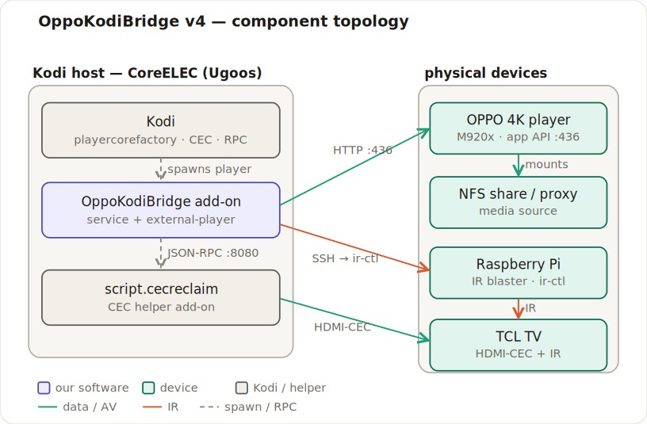
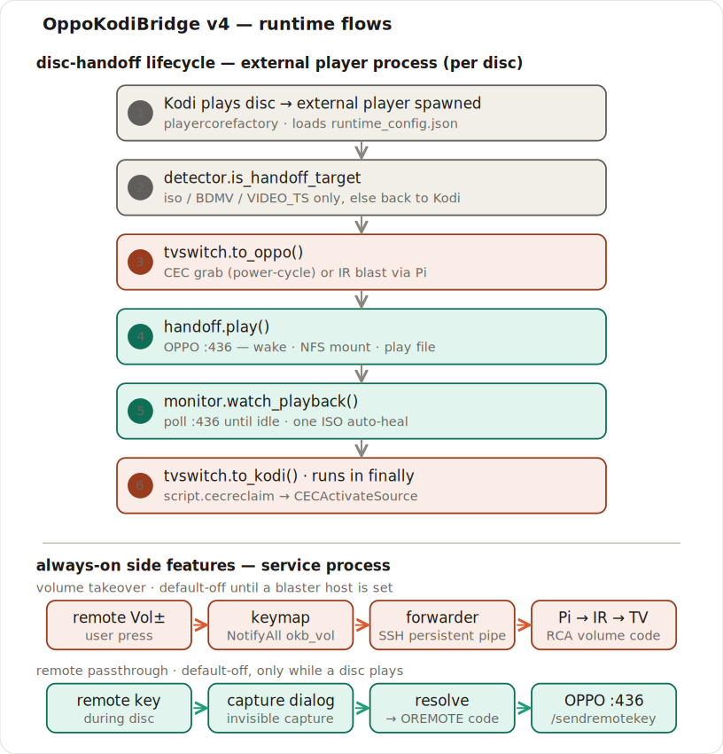

# OppoKodiBridge v4 — system architecture (whole-system map)

A component- and subsystem-level map of the **entire** add-on as it stands today, across all features:
the disc handoff, the pluggable TV-switch strategies (CEC / IR), remote passthrough, and TV volume
takeover over IR.

> This is the **breadth** view. For the original CEC-handoff hypothesis and the play→stop walkthrough in
> depth, see [`ARCHITECTURE.md`](ARCHITECTURE.md); for the rendered CEC/journey diagrams see
> [`DIAGRAMS.md`](DIAGRAMS.md). The IR transports have their own references:
> [`IR_TVSWITCH_DESIGN.md`](IR_TVSWITCH_DESIGN.md), [`IR_LIRC_RPI4.md`](IR_LIRC_RPI4.md),
> [`IR_INTEGRATION.md`](IR_INTEGRATION.md).

---

## The core idea

v4's defining move is **no-blip handoff via Kodi's playercorefactory**. Rather than a service that lets
Kodi start a disc and then yanks it back (the v2 "blip"), the service writes a `playercorefactory.xml`
that routes `.iso` / BDMV / VIDEO_TS content to an **external player** *before* Kodi's own player ever
opens the file.

That single decision splits the add-on into **two processes**:

- **Service process** — `service.py` → [`service_cec.main()`](../service.oppokodibridge.v4/resources/lib/service_cec.py),
  long-lived inside Kodi. It is the only code with `xbmcaddon` access, so it resolves the settings and
  **publishes `runtime_config.json`**, installs the `playercorefactory.xml`, and hosts the two always-on
  features (volume takeover, remote passthrough). It never intercepts playback.
- **External player process** — [`pcf_player.py`](../service.oppokodibridge.v4/pcf_player.py) →
  [`orchestrator.run()`](../service.oppokodibridge.v4/resources/lib/orchestrator.py), spawned by Kodi
  *per disc*, runs outside Kodi and reads the published `runtime_config.json` (no `xbmcaddon`). The whole
  handoff lifecycle lives here.

A third, separate companion add-on — **`script.cecreclaim`** — runs inside Kodi purely to re-announce
Kodi's own HDMI-CEC active source on stop.

---

## Component topology

> If the image doesn't render, open the SVG directly:
> [`docs/diagrams/oppokodibridge-v4-component-topology.svg`](diagrams/oppokodibridge-v4-component-topology.svg)

The Kodi host holds the software; the four physical devices sit outside it. Every device link is
labelled with its protocol — HTTP `:436` (OPPO app API), SSH (to the Pi IR blaster), JSON-RPC `:8080`
(localhost, into Kodi), HDMI-CEC and IR.

---

## Runtime flows

> If the image doesn't render, open the SVG directly:
> [`docs/diagrams/oppokodibridge-v4-runtime-flows.svg`](diagrams/oppokodibridge-v4-runtime-flows.svg)

### 1 · Disc-handoff lifecycle (external player process, per disc)

`orchestrator.run` is a clean linear flow — **single-shot and event-tied**:

1. **Kodi plays a disc** → `playercorefactory.xml` routes it to `pcf_player.py`, which loads
   `runtime_config.json`.
2. [`detector.is_handoff_target`](../service.oppokodibridge.v4/resources/lib/detector.py) — accept only
   `.iso` / BDMV / VIDEO_TS; anything else is handed back to Kodi.
3. `tvswitch.to_oppo()` — switch the TV to the OPPO input (strategy-dependent; see below).
4. [`handoff.play()`](../service.oppokodibridge.v4/resources/lib/handoff.py) — drive the OPPO over its
   HTTP app API on `:436`: wake → init dance → NFS login/mount → play the file. Mount and play are hard
   gates (abort-before-play on an unconfirmed mount).
5. [`monitor.watch_playback()`](../service.oppokodibridge.v4/resources/lib/monitor.py) — poll
   `/getglobalinfo` until idle. Phase 1 waits for playback to start (one ISO auto-heal re-issue); phase 2
   watches until N idle reads, bounded by read-failure and watch-time ceilings so it always returns.
6. `tvswitch.to_kodi()` — reclaim the TV to Kodi, **in a `finally`** so it runs whether playback
   succeeded or failed. No standing re-asserter, so a manual input change sticks.

### 2 · Volume takeover over IR (service process, always-on, default-off until configured)

The M920x's network volume is inert (fixed-level / AVR audio), so the remote's Vol± drive the **TV**
over IR instead: a Kodi keymap remaps `volume_up`/`down` → `NotifyAll`; `service_cec.onNotification`
matches it to an RCA code via [`volumeir.volume_command`](../service.oppokodibridge.v4/resources/lib/volumeir.py);
a worker thread (`VolumeIrForwarder`) fires it at the TV through a **persistent SSH pipe** to the Pi.

### 3 · Remote passthrough (service process, default-off, only while a disc plays)

While a handed-off disc plays, an invisible full-screen dialog
([`passthrough_ui.py`](../service.oppokodibridge.v4/resources/lib/passthrough_ui.py)) captures the
remote, resolves each key to an OPPO OREMOTE code
([`passthrough.resolve`](../service.oppokodibridge.v4/resources/lib/passthrough.py)), and forwards it to
the OPPO over `:436 /sendremotekey` on a worker thread — so you can drive the Blu-ray menu.

---

## TV-switch strategy family

[`tvswitch.make_switcher()`](../service.oppokodibridge.v4/resources/lib/tvswitch.py) selects an
implementation from `tv_switch_method`, all behind one `to_oppo()` / `to_kodi()` contract (each
single-shot, non-fatal, returning an honest bool).

| `tv_switch_method` | `to_oppo()` (play) | `to_kodi()` (stop) | Module | Host |
|--------------------|--------------------|--------------------|--------|------|
| `none` | no-op (manual) | no-op | `tvswitch.NullSwitcher` | — |
| `cec` **(default)** | model-gated OPPO one-touch-play grab (power-cycle) | Kodi self-reclaim | [`cec.py`](../service.oppokodibridge.v4/resources/lib/cec.py) | Kodi host |
| `ir` | blast TV HDMI-input NEC over serial ZJIoT module | CEC reclaim | [`ir_zjiot.py`](../service.oppokodibridge.v4/resources/lib/ir_zjiot.py) + [`ir_proto.py`](../service.oppokodibridge.v4/resources/lib/ir_proto.py) | Kodi host (USB-TTL) |
| `lirc` | blast TV HDMI-input NEC on local `/dev/lirc0` via `ir-ctl` | CEC reclaim | [`ir_lirc.py`](../service.oppokodibridge.v4/resources/lib/ir_lirc.py) | Kodi host (GPIO) |
| `ir_remote` | SSH to a Pi; drive the TCL RCA-15 on-screen input picker | CEC reclaim | [`ir_remote.py`](../service.oppokodibridge.v4/resources/lib/ir_remote.py) | Raspberry Pi |

The default `cec` reproduces the original inline behaviour exactly. IR transports are imported lazily —
only the selected one loads.

---

## Module reference

### Service lifecycle & handoff orchestration

| File | Role |
|------|------|
| [`service.py`](../service.oppokodibridge.v4/service.py) | Add-on entry (`library="service.py"`); delegates to `service_cec.main()`. |
| [`resources/lib/service_cec.py`](../service.oppokodibridge.v4/resources/lib/service_cec.py) | The long-lived service: publishes `runtime_config.json`, installs/removes `playercorefactory.xml`, syncs the volume keymap + runs `VolumeIrForwarder`, runs the passthrough tick loop. `onSettingsChanged` refreshes all of it; `onNotification` is the volume-takeover fast path. |
| [`pcf_player.py`](../service.oppokodibridge.v4/pcf_player.py) | The external player Kodi spawns per disc. Runs outside Kodi, loads `runtime_config.json`, calls `orchestrator.run`, and never crashes the player process (exit 0/1/2). |
| [`resources/lib/orchestrator.py`](../service.oppokodibridge.v4/resources/lib/orchestrator.py) | The handoff flow: detect → `to_oppo` → play → watch → `to_kodi` (in `finally`) + a best-effort give-up STOP. |
| [`resources/lib/monitor.py`](../service.oppokodibridge.v4/resources/lib/monitor.py) | Two-phase HTTP playback watch (start-with-auto-heal, then watch-until-idle); tri-state so a blip isn't a stop; bounded so it always returns. |
| [`resources/lib/kodilog.py`](../service.oppokodibridge.v4/resources/lib/kodilog.py) | Logging shim — `xbmc.log` inside Kodi, `print` off-box (keeps pure modules importable in tests). |

### Handoff, detection, config & setup wizard

| File | Role |
|------|------|
| [`resources/lib/handoff.py`](../service.oppokodibridge.v4/resources/lib/handoff.py) | Headless OPPO playback over the HTTP app API: wake → init → NFS login/mount → play. No TV switching, no monitoring. Cooperatively abortable. |
| [`resources/lib/detector.py`](../service.oppokodibridge.v4/resources/lib/detector.py) | Pure disc classifier (`is_handoff_target`) **and** the source of `PCF_RULES`, both derived from the same constants so the generated XML and runtime check can't drift. |
| [`resources/lib/config.py`](../service.oppokodibridge.v4/resources/lib/config.py) | Kodi-free `Config` dataclass (~60 fields) + the only Kodi-aware loader `from_addon()` + per-model OPPO IP resolution. |
| [`resources/lib/pcf.py`](../service.oppokodibridge.v4/resources/lib/pcf.py) | Builds + installs/uninstalls `playercorefactory.xml`; XML-escapes all values; only ever backs up / removes a file carrying its own marker. |
| [`resources/lib/wizard.py`](../service.oppokodibridge.v4/resources/lib/wizard.py) | First-run wizard **logic** behind `ui`/`settings`/`client` adapters (unit-testable off-box). |
| [`wizard.py`](../service.oppokodibridge.v4/wizard.py) | Kodi `RunScript` entry + the real `xbmcgui`/settings adapters; `firstrun` guard reads `wizard_done`. |

### OPPO control

| File | Role |
|------|------|
| [`resources/lib/oppo_http.py`](../service.oppokodibridge.v4/resources/lib/oppo_http.py) | `OppoClient` + pure parse helpers for the OPPO/M920x app API: wake, NFS login/mount, play, `sendremotekey`, playback-state probes; plus `:23` IP-control (`#POF`/`#PON`) and optional RS-232. Idempotency policy: mount/play/stop never retry; reads may. |

### TV switching & IR transports

| File | Role |
|------|------|
| [`resources/lib/tvswitch.py`](../service.oppokodibridge.v4/resources/lib/tvswitch.py) | Strategy factory + `to_oppo()`/`to_kodi()` contract; lazily imports the selected transport. |
| [`resources/lib/cec.py`](../service.oppokodibridge.v4/resources/lib/cec.py) | The only place CEC is asserted: model-gated OPPO grab (`grab_oppo` → `power_cycle`) + Kodi reclaim (`reclaim_kodi` → JSON-RPC → `script.cecreclaim`); also `kodi_video_sources` for path autodetect. Never raises. |
| [`resources/lib/ir_remote.py`](../service.oppokodibridge.v4/resources/lib/ir_remote.py) | SSH remote-blaster: one-shot input-picker sequence for `to_oppo`, plus `PersistentBlaster` (a persistent SSH `python3` read-loop) for rapid volume keys. RCA-15 frames. |
| [`resources/lib/ir_zjiot.py`](../service.oppokodibridge.v4/resources/lib/ir_zjiot.py) | Serial ZJIoT transport: NEC-carrying module frame over raw POSIX `termios`. Ships default-off; NEC byte-order provisional (#34). |
| [`resources/lib/ir_lirc.py`](../service.oppokodibridge.v4/resources/lib/ir_lirc.py) | Local LIRC transport: `ir-ctl -S nec:<scancode>` on the Kodi host's `/dev/lirc0`. |
| [`resources/lib/ir_proto.py`](../service.oppokodibridge.v4/resources/lib/ir_proto.py) | Pure codec: ZJIoT frame format + NEC pulse/space waveform synthesis. No I/O. |

### Remote passthrough

| File | Role |
|------|------|
| [`resources/lib/passthrough.py`](../service.oppokodibridge.v4/resources/lib/passthrough.py) | Pure, Kodi-free core: map a Kodi action/button-code → OREMOTE key (`resolve`), parse overrides + ignore/leak codes, and the arm/disarm decision (`arm_decision`). |
| [`resources/lib/passthrough_ui.py`](../service.oppokodibridge.v4/resources/lib/passthrough_ui.py) | Kodi runtime: `PassthroughRunner` polls OPPO state each tick and opens/closes an invisible `WindowDialog` that forwards keys to the OPPO on a bounded-queue worker thread. |

### TV volume takeover over IR

| File | Role |
|------|------|
| [`resources/lib/volumeir.py`](../service.oppokodibridge.v4/resources/lib/volumeir.py) | Generates/installs/removes the volume-takeover keymap; matches the `NotifyAll` to an RCA volume code; `VolumeIrForwarder` (daemon thread + persistent IR pipe) fires it at the TV. Config refresh is generation-counted (no restart). |

### Companion helper add-on (separate package)

| File | Role |
|------|------|
| [`desktop/kodi-helper/script.cecreclaim/addon.xml`](../desktop/kodi-helper/script.cecreclaim/addon.xml) | Manifest for `script.cecreclaim` v1.1.0 (a `xbmc.python.script` executable). |
| [`desktop/kodi-helper/script.cecreclaim/default.py`](../desktop/kodi-helper/script.cecreclaim/default.py) | Single-shot: `xbmc.executebuiltin("CECActivateSource")` so Kodi re-announces its own active source. Invoked via JSON-RPC `Addons.ExecuteAddon`. Installed + enabled alongside the main add-on. |

---

## External interfaces & protocols

| Interface | Transport | Used by | Notes |
|-----------|-----------|---------|-------|
| OPPO app API | HTTP GET `:436` | `oppo_http` | `getmainfirmwareversion`, `getsetupmenu`, `signin`, `getdevicelist`, `getglobalinfo`, `getplayingtime`, `loginNfsServer`, `getNfsShareFolderlist`, `mountNfsSharedFolder`, `playnormalfile`, `checkfolderhasBDMV`, `sendremotekey` |
| OPPO wake | UDP `:7624` | `oppo_http.wake_and_wait` | `NOTIFY OREMOTE LOGIN` packet |
| OPPO IP-control | TCP `:23` | `cec.grab_oppo` → `power_cycle` | `#POF` / `#PON` (M9205 grab only) |
| OPPO serial | RS-232 `/dev/ttyUSB0` | `oppo_http.serial_command` | optional; lazy `termios` |
| Kodi control | JSON-RPC `POST 127.0.0.1:8080` | `cec.py` | `Addons.ExecuteAddon(script.cecreclaim)`, `Files.GetSources` — needs Kodi's web server on |
| Pi IR blaster | SSH → `python3` → `ir-ctl` → `/dev/lirc0` | `ir_remote` | one-shot switch + persistent volume pipe |
| Media | NFS (OPPO mounts the share) | OPPO ← `handoff`/`oppo_http` | mount the file's folder, play the bare leaf |
| Published config | `special://masterprofile/addon_data/service.oppokodibridge.v4/runtime_config.json` | service writes, `pcf_player` reads | the bridge between the two processes |
| Routing | `special://profile/playercorefactory.xml` | service writes, Kodi reads **at boot** | must persist; fresh install needs one restart |
| Volume keymap | `special://profile/keymaps/okb_volume_takeover.xml` | `volumeir` writes | reloaded at runtime via `Action(reloadkeymaps)` |

---

## Design principles

- **Pure cores, off-box testable.** `detector`, `config`, `passthrough`, `ir_proto`, and the
  `volumeir`/`wizard` logic import no `xbmc`, so the ~332-test suite runs without hardware. Kodi / HTTP /
  SSH / serial I/O all sit behind thin adapters.
- **`runtime_config.json` is the process bridge.** The external player can't call `xbmcaddon`, so the
  in-Kodi service dumps the resolved settings to JSON for it to read.
- **Single source of truth.** The playercorefactory routing rules are *derived from* the same `detector`
  constants the runtime matches on — the generated XML can't drift from the in-process check (pinned by a
  test).
- **Assert once per event, never re-assert.** Every TV switch (`to_oppo` on play, `to_kodi` on stop) is
  single-shot; there is no standing re-asserter, so a manual input change stays.
- **Best-effort, non-fatal by contract.** Config publish, TV switch, give-up STOP, keymap sync, and all
  IR / volume / passthrough I/O are wrapped so a transport or hardware failure never skips the TV reclaim
  or crashes the service.
- **Default-off for anything new.** IR transports, remote passthrough, and volume takeover all ship off;
  the proven CEC handoff path is unchanged unless you opt in.

---

## Related docs

- [`architecture.html`](architecture.html) — this whole-system view as a single self-contained,
  theme-aware HTML page (open in a browser; the diagrams are inlined).
- [`ARCHITECTURE.md`](ARCHITECTURE.md) — the CEC-handoff design & play→stop walkthrough (depth).
- [`DIAGRAMS.md`](DIAGRAMS.md) — rendered CEC architecture + per-model user-journey diagrams.
- [`PLAYING_DISCS_FROM_NETWORK.md`](PLAYING_DISCS_FROM_NETWORK.md) — the NFS mount/play path.
- [`IR_TVSWITCH_DESIGN.md`](IR_TVSWITCH_DESIGN.md) · [`IR_LIRC_RPI4.md`](IR_LIRC_RPI4.md) ·
  [`IR_INTEGRATION.md`](IR_INTEGRATION.md) — the IR transports (design, RPi4 build, historical).
- [`MANUAL_VERIFICATION_CHECKLIST.md`](MANUAL_VERIFICATION_CHECKLIST.md) — the hardware-verify log.
